# Lab UX UNCA

Aplicación web construida con **React.js** y **Next.js**.

## 🧱 Tecnologías

- [ ] React 18+
- [ ] Next.js 14+
- [ ] TypeScript (si aplica)
- [ ] Tailwind CSS (si aplica)
- [ ] Axios / React Query
- [ ] ESLint + Prettier
- [ ] Shadcn

## 🗂️ Estructura general del proyecto (Diagrama Mermaid)

```mermaid
graph TB
    Proyecto["📁 Proyecto"] --> .next["📦 .next"]
    Proyecto --> node_modules["📁 node_modules"]
    Proyecto --> public["🖼️ public"]
    Proyecto --> src["💻 src"]
    Proyecto --> styles["🎨 styles"]
    Proyecto --> .env["⚙️ .env"]

    .next --> A1["❗ Generado automáticamente. No editar."]
    node_modules --> A2["❗ Dependencias instaladas. No editar."]
    public --> A3["🌐 Archivos estáticos (favicon, imágenes...)"]
    src --> A4["🧠 Código fuente (componentes, lógica, páginas)"]
    styles --> A5["💅 Estilos (Tailwind, CSS, etc)"]
    .env --> A6["🔐 Variables de entorno (API keys, URLs)"]

    .next -->|Generado automáticamente| A1["❗ No editar manualmente"]
    node_modules -->|Instalación de dependencias| A2["❗ No editar manualmente"]
    public -->|Archivos estáticos| A3["🌐 Imágenes, favicon, etc"]
    src -->|Código fuente| A4["🧠 Componentes, lógica, páginas"]
    styles -->|Estilos visuales| A5["💅 Tailwind, CSS"]
    .env -->|Variables sensibles| A6["🔐 API keys, config"]
```

## 🗂️ Carpeta de trabajo src
### App
Dentro de esta carpeta se encuentra las dos vistas del proyecto.
- [ ] admin : Vista solo para el administrador
- [ ] public : Vista publica, no se necesita loguearse
- [ ] Componentes tipo layout.tsx : Layouts dependiendo de la vista. ❗layoutSwitcher.tsx contiene la logica y manejo de las vista.
### Components
Esta capeta contiene:
- [ ] UI: Componentes como Button.tsx o Label.tsx, los cuales no se modifican, solo se reutilizan. Se ocupa Shadcn
- [ ] Hooks : De acuerdo con los componentes generales, como useToast.ts
### Config
Esta carpeta contiene un archivo llamado endpoints.ts, el cual contiene  (URLs) de la API que se pueden mandar a llamar como constantes.
###Constans
Contiene informacion del sitio estatica, dentro de archivos como:
- [ ] Api.ts : URL de la api
- [ ] data.ts : datos de ejemplo para el sitio
- [ ] navbar.ts : Interface con los elementos del menu principal.
### Hooks
Aqui se encuentran los hooks de componentes que no se reutilizan, como un el formulario de usuarios, o de proyectos. 
### Lib 
Agrupa funciones reutilizables que ayudan a mantener el código limpio y organizado como:
- [ ] Contiene funciones para formatear fechas
- [ ] Utilidades para clases CSS y colores de estado.
### Services
Contiene los servicios para consulta al backend
- [ ] usuario
- [ ] proyecto
- [ ] metodologia
- [ ] glosario
- [ ] evento o Noticia
- [ ] area de investigacion
> [!NOTE]
> Existe un archivo index.ts en el cual se pueden agregar los otros servicios como constantes. Esto es util ya que no se necesita llamar a cada servicio a su respectivo archivo, como services/users/updateUser, sino services/index, solo se llama al archivo index.
### Styles
Esta carpeta solo contiene un archivo global con estilos css
### Types
Esta carpeta contiene multiples archivos de tipo ts, sirven organizar y centralizar las definiciones de interfaces y tipos TypeScript que describen la forma de los datos.
> [!NOTE]
> Existe un archivo index.ts, al igual que el archivo dentro de services, sirve para centralizar los llamados a las interfaces, solo se manda a llamar este archivo como types/index y se accede a cualquier interfaz.
## 🌐 Aspectos importantes sobre el proyecto
- [ ] Next.js utiliza un sistema de enrutamiento automático basado en archivos. Al crear carpetas y archivos dentro de la carpeta app/, se generan rutas que siguen esa misma estructura. No se necesita configurar rutas manualmente.
- [ ] Las carpetas cuyo nombre está entre paréntesis, como (soporte), se denominan "segmentos de grupo" (group segments) en Next.js. Estas carpetas no afectan la ruta URL ni se convierten en parte del enrutamiento. Se utilizan únicamente para organizar el código internamente dentro de la carpeta app/ sin modificar la estructura de las rutas públicas.
- [ ] Dentro de app, en las rutas existen carpetas de componentes, los cuales son unicos para cada seccion. Por ejemplo dentro de admin/usuarios esta otra carpeta llamada componentes, la cual contiene dialogs, formularios o toast. Mantaner el codigo dividido por componentes lo hace modular y menos extenso.

> [!TIP]
> - [ ] Modula el codigo por componentes y evita que sea largo. Separa por componentes y agregalos a carpetas "componentes" de acuerdo a la seccion.
> - [ ] Evita mandar a llamar la constante API_URL dentro de los componentes, mejor utiliza los servicios o crea nuevos si es necesario dentro de Services.
> - [ ] Reutiliza los componentes del proyecto de la libreria Shadcn, ahorraras tiempo y se mantendra el diseño del sitio.
> - [ ] En cuanto termines de utilizar una rama, borrala. 
